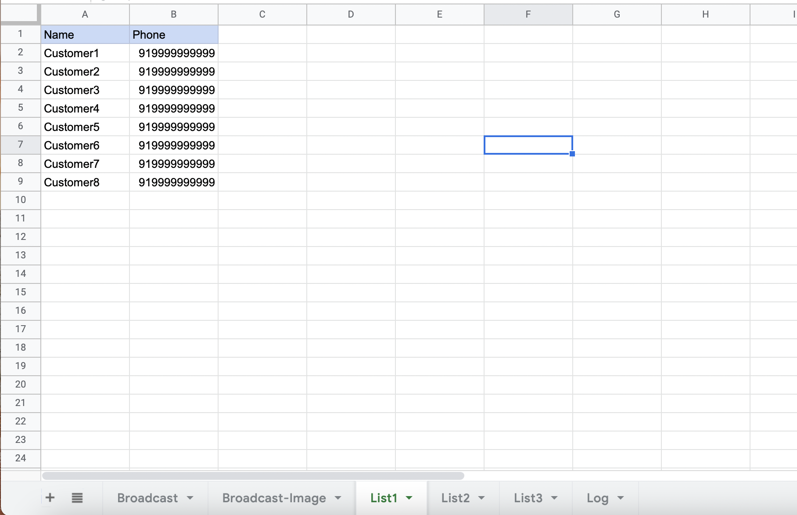
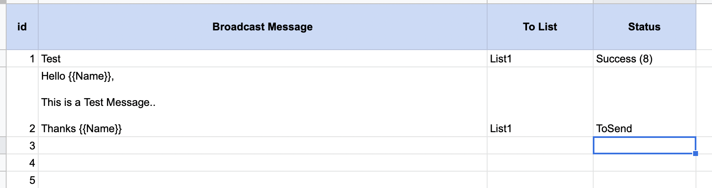
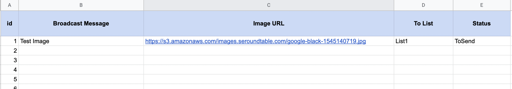

## Making Broadcast Lists
1. Open the Google Sheet configured with your WhatsApp number.
2. Open List1 (or any other list) and fill the customers details

## Broadcast Personalised Text Messages
1. In Broadcast Sheet fill in the Broadcast message to send, the list to send messages to & when ready set `Status` to `ToSend`.

2. In Broadcast Message, use `{{Name}}` to use Name of Customer for a personal touch.

3. Within 1 minute the messages will be sent to the List.

 
4. You can check the log in the Log sheet

## Broadcast Images
1. In Broadcast-Image sheet fill in the Broadcast Message to send, the Image URL (should end with .jpg or .png), ToList.

2. Set the Status to `ToSend` and the images will be sent.